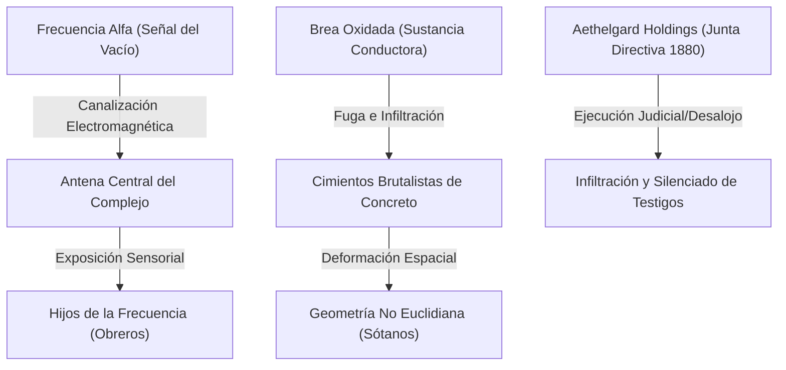

# 📖 06. Manual de Conducción para el Guardián

Este documento proporciona pautas de dirección, consejos de ritmo, directrices de atmósfera analógica y un mapa de congruencia narrativa para guiar al Guardián en la mini-campaña **Brea Oxidada**.

---

## 🏛️ 1. Mapa de Congruencia Narrativa (El Gran Secreto)

Para dirigir con autoridad intelectual y coherencia, el Guardián debe comprender el "Por Qué" detrás de cada fenómeno:

* **El Plan de Aethelgard Holdings:** La corporación no busca ganancias financieras. La quiebra y posterior desalojo del [[Complejo Industrial]] es una tapadera legal organizada por [[Julian Aethelgard]] para evacuar la zona de trabajadores corrientes y policías locales antes de realizar la transmisión nacional de [[La Frecuencia Alfa]].
* **La Función de la Brea:** La [[Brea Oxidada]] no es un residuo contaminante común. Es una marea física de espacio de dos dimensiones que se filtra en nuestro plano de tres dimensiones. Actúa como el "cableado" o "toma de tierra" que permite a [[La Frecuencia Alfa]] estabilizarse en el concreto del complejo, doblando las habitaciones y pasillos en ángulos no euclidianos.
* **El Destino de los Investigadores:** El equipo de [[Derecho]], [[Ingeniería]] y [[Literatura]] no fue enviado allí por azar; Arthur Pendelton los seleccionó bajo la presión indirecta de Aethelgard Holdings, quienes esperaban que un equipo técnico independiente certificara que la fábrica era "inhabitable y peligrosa", dándoles el pretexto perfecto para sellar los accesos y evitar inspecciones estatales futuras.

---

## ⏱️ 2. Guía de Ritmo (Pacing) por Sesión

Cada una de las 4 sesiones está diseñada para durar aproximadamente **3 a 4 horas de juego**. Sigue estas directrices de dirección para evitar cuellos de botella:

### Sesión 1: El Eco Magnético (Terror de Baja Intensidad)
* **Tono:** Misterio burocrático e industrial.
* **Foco:** Los investigadores deben sentirse como profesionales haciendo un trabajo aburrido (revisar expedientes, catalogar herramientas) hasta que suena la cinta.
* **Consejo del Guardián:** No introduzcas monstruos ni combates físicos en esta sesión. El horror debe ser puramente atmosférico: sombras que tardan en moverse, teléfonos que suenan con estática y la alteración de gravedad del clímax que dura solo unos minutos pero rompe su concepción de la física.

### Sesión 2: Geometría de Concreto (Supervivencia y Exploración)
* **Tono:** Claustrofobia y horror espacial.
* **Foco:** El descenso al sótano. El peligro son las deformaciones espaciales y el primer encuentro con las criaturas.
* **Consejo del Guardián:** Usa la [[03_Bestiario_y_Anomalias#Tabla de Geometría Hostil|Tabla de Geometría Hostil]] de forma activa para desorientar a los jugadores. Si los jugadores se impacientan por no encontrar la salida, haz que escuchen los lamentos de [[Julia Pendelton]] a través de los tubos de vapor para guiarlos hacia la sala de generadores.

### Sesión 3: El Cifrado Corporativo (Conspiración y Sigilo)
* **Tono:** Thriller de infiltración y paranoia corporativa.
* **Foco:** El asalto o infiltración legal en la sede de [[Aethelgard Holdings]].
* **Consejo del Guardián:** Permite que los [[Abogados]] del grupo destaquen usando su estatus legal o recursos burocráticos para acceder al piso 14 en la primera mitad. Convierte la segunda mitad en una tensa persecución de supervivencia contra los [[Ajustadores Corporativos]] bajo la tormenta.

### Sesión 4: La Frecuencia Alfa (El Clímax y Desenlace)
* **Tono:** Horror cósmico desatado y catástrofe inminente.
* **Foco:** Detener la transmisión en la torre de refrigeración.
* **Consejo del Guardián:** No resuelvas el clímax con un combate de disparos tradicional. Los Ajustadores y [[La Frecuencia Encarnada]] diezmarán al grupo si intentan pelear de frente. Enfatiza que los ingenieros deben manipular las consolas y los literatos descifrar el manuscrito mientras los abogados organizan el corte de energía auxiliar para salvar el día.

---

## 🎨 3. Consejos de Narración y Sensoriales

Para transmitir el terror analógico y no euclidiano de 1986, utiliza descripciones que apelen a los sentidos analógicos de los jugadores:
* **El Oído:** Describe el zumbido constante de 60 Hz en el fondo. El "clack-clack" mecánico de los disyuntores de la fábrica, el chasquido del plástico de los cassettes y el pitido sordo y agudo de las terminales de fósforo verde.
* **La Vista:** Describe el color del mundo bajo la estática. Enfatiza la distorsión geométrica: *"Los ángulos de la esquina de la habitación no suman 90 grados; al mirarla fijamente, tu ojo no puede enfocar dónde se une la pared con el techo, provocándote un mareo instantáneo"*.
* **El Tacto y el Olfato:** El olor a ozono, aceite de motor quemado, asfalto caliente y hierro oxidado. La textura de la [[Brea Oxidada]]: fría como el metal pero viscosa como el alquitrán caliente.

---

## 🧠 4. Gestión de la Disonancia Estática (PE)

La mecánica de **Puntos de Estática** (ver [[02_Mecanicas_CoC7|Mecánicas de Juego]]) es tu termómetro de tensión:
* **Uso Progresivo:** No acumules PE de golpe en la Sesión 1. Usa la primera sesión para que alcancen el Umbral Leve (1-4 PE).
* **El Clímax de la Estática:** En la Sesión 4, la presencia del emisor y los pozos de brea aumentarán rápidamente los PE. Describe activamente las distorsiones físicas en los personajes cuando crucen el Umbral Grave (10+ PE) para que sientan la inminencia de convertirse en [[Hijos de la Frecuencia]].
* **Efectos de Monitor:** Cuando los personajes sufran *visión de fósforo*, háblales describiendo los colores como gamas de verde o ámbar en lugar de colores normales.

---

## 🤝 5. El Reparto de Foco Profesional

Para que la campaña funcione como un engranaje sólido, el Guardián debe equilibrar el protagonismo de las tres especialidades:

1. **Escenas de Derecho (Abogados):** Negociaciones con la policía local, auditorías de los contratos firmados con ADN, confrontaciones legales y de seguridad en el piso 14 de la corporación.
2. **Escenas de Ingeniería (Ingenieros):** Purgado de calderas, manipulación del transformador auxiliar del laberinto, reparación de los sistemas BBS e inhibidores de radio.
3. **Escenas de Literatura (Academia/Archiveros):** Descifrado del poema hermético, traducción de correspondencia mística del siglo XIX, comprensión de las letanías cuánticas y apaciguamiento de los entes trágicos como Julia.
