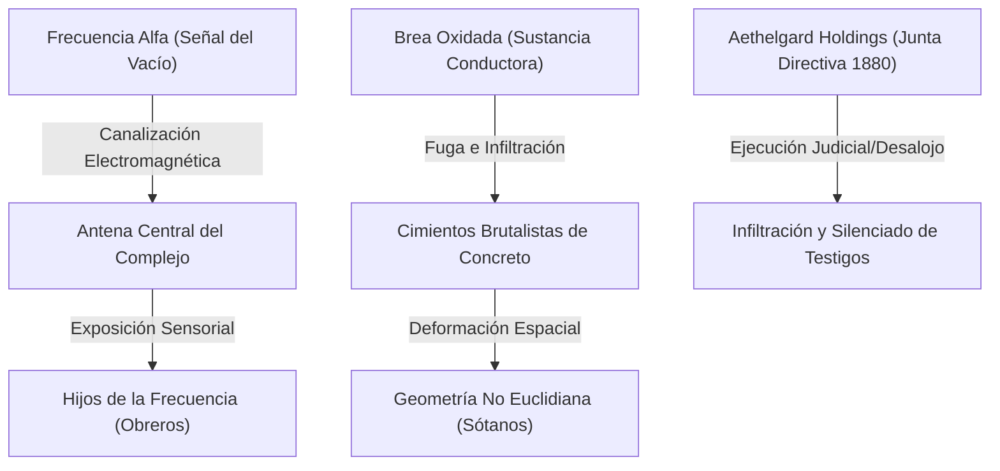

# 📖 06. Advertencias Finales para el Analista de Campo

*El siguiente documento constituye una recopilación de directrices y advertencias de campo redactadas por el anterior inspector judicial que fracasó en la cuenca. Actúa como guía para el Guardián sobre la modulación del ritmo, el soporte sensorial y el equilibrio de foco profesional.*

---

## 🏛️ 1. Mapa de Congruencia Narrativa (El Gran Secreto)

Para dirigir con coherencia y evitar desviar el tono de horror analógico hacia la fantasía clásica, el Guardián debe comprender las conexiones físicas del fenómeno:

* **El Plan de la Corporación:** Aethelgard Holdings no busca ganancias. El desalojo es un ardid legal para evacuar la zona antes del encendido final de la antena.
* **La Brea como Conductor:** La sustancia no es residuo tóxico. Actúa como antena física para [[La Frecuencia Alfa]]. Al resonar en el concreto brutality, deforma el espacio-tiempo de los sótanos, aplastando el volumen tridimensional de lo que toca.

---

## ⏱️ 2. Guía de Ritmo (Pacing) por Fases

Cada fase de la bitácora (ver [[01_Cronograma_de_Campana|Cronograma]]) debe durar entre **3 y 4 horas de juego**:

* **Fase I (El Eco Magnético):** Tono de misterio técnico. No introduzcas combates ni monstruos. El horror debe ser puramente ambiental: parpadeos de luz, estática de radio y el fenómeno de gravedad invertida que altera la perspectiva por unos minutos.
* **Fase II (La Geometría de Concreto):** Claustrofobia pura. Los pasillos se curvan infinitamente. Utiliza la [[03_Bestiario_y_Anomalias#Tabla de Geometría Hostil|Tabla de Geometría Hostil]] de forma activa para desorientar a los jugadores. Si se pierden, haz que escuchen los lamentos de Julia a través del interfono para guiarlos.
* **Fase III (El Cifrado Corporativo):** Thriller de sigilo. Permite que los abogados destaquen con órdenes judiciales de la corte civil de Arthur Pendelton en la primera mitad, y convierte la segunda mitad en una huida en las sombras contra los Ajustadores.
* **Fase IV (La Emisión Final):** Clímax tenso. Los ingenieros operan el panel del emisor, los literatos traducen el manuscrito antiguo de 1926 y los abogados desvían la energía auxiliar mientras son asediados.

---

## 🎨 3. Dirección Sensorial y Atmosférica

Para emular el estilo de *Aire Frío*, las descripciones deben apelar a sentidos específicos:
* **El Oído:** El persistente zumbido de 60 Hz de los transformadores, el "clack-clack" metálico de los disyuntores de la fábrica, la estática rítmica de los altavoces analógicos.
* **La Vista:** La visión en scanlines amarillas o verdes. Describe la contradicción geométrica: *"Los ángulos de la esquina del hangar no suman 90 grados; al mirarla fijamente, tu ojo no puede enfocar dónde se une la pared con el techo, provocándote náuseas"*.
* **El Tacto y Olfato:** El vaho químico a queroseno, salinas de la cuenca, metal oxidado y asfalto caliente. La textura de la brea: fría al tacto pero viscosa y biológicamente activa.

---

## 🧠 4. Gestión de la Disonancia Estática (PE)

* **Progresión:** No inflijas PE de golpe en la Fase I. Úsala para generar tinnitus en la primera sesión (Umbral Leve).
* **El Clímax:** En la Fase IV, la presencia del emisor y los charcos de brea aumentarán rápidamente los PE. Describe activamente las distorsiones físicas en los personajes cuando crucen el Umbral Grave (10+ PE) para acentuar la prisa.

---

## 🤝 5. Equilibrio de Foco Profesional

* **Foco Derecho (Abogados):** Interrogatorios con el oficial Burke, análisis del contrato firmado con ADN líquido, amparo burocrático frente a los directivos de Aethelgard.
* **Foco Ingeniería (Ingenieros):** Purgado de calderas, puentear transformadores de alta tensión, construir inhibidores de ondas analógicos.
* **Foco Academia (Literatos):** Descifrar los versos del manuscrito de 1926, traducir correspondencia victoriana, interactuar con Julia Pendelton a través del interfono.
