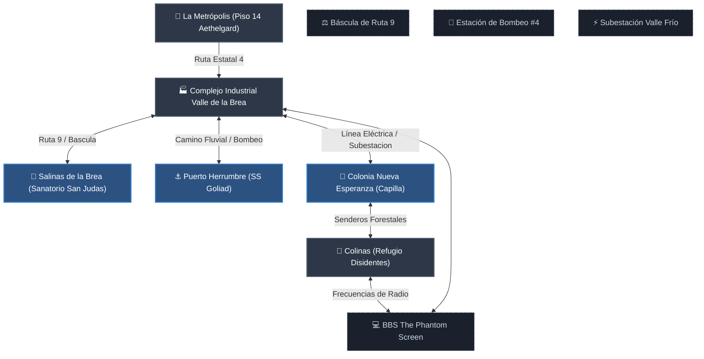
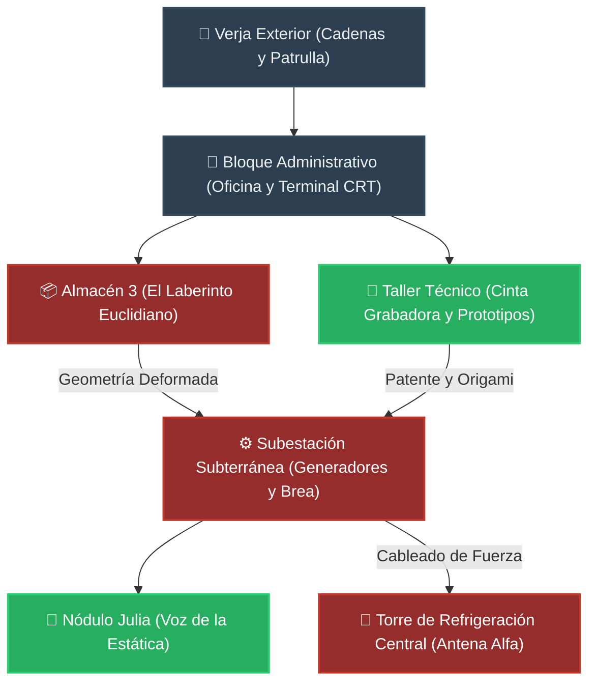
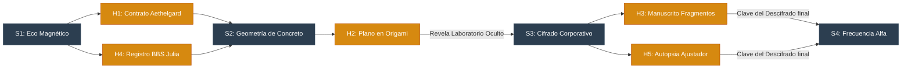

# 🗺️ 08. Diagramas y Cartografía de la Campaña

Este documento reúne las representaciones esquemáticas en formato **Mermaid** para guiar al Guardián en la visualización geográfica, la estructura arquitectónica del complejo y el flujo deductivo de la campaña.

---

## 🗺️ 1. Mapa Regional de la Cuenca (Valle de la Brea)

Este diagrama simula las rutas y puntos de pesaje, bombeo y subestaciones que conectan la metrópolis con el complejo y los municipios aledaños de la cuenca salina.

---

## 🏢 2. Estructura Arquitectónica del Complejo Valle de la Brea

Este plano simula la distribución física y no euclidiana interna de las instalaciones industriales y sus niveles de hostilidad o interés clave.

---

## 🔍 3. Mapa Deductivo de Pistas (Flujo de la Investigación)

Este diagrama ilustra la relación causa-efecto de los handouts y cómo guían al grupo de sesión en sesión.

